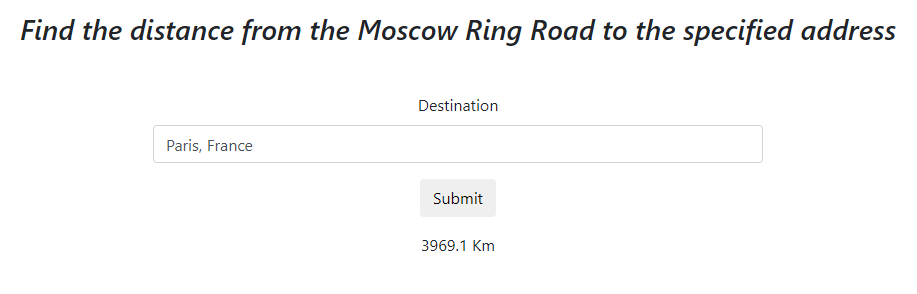

# Distance Calculator

A fast and simple geographical distance calculator. This module calculates
"as the crow flies" distance between two points using the geopy

## Installation

Install using pip:

    $ pip install -r requirements.txt

##Run application

To start the application, open the terminal at the root of the project and 
run the code:

    $ python run.py runserver

## Example

This is the interface:

The use is very simple, only writte a full address and click in Submit

# distance-calculator-test-task-flask
